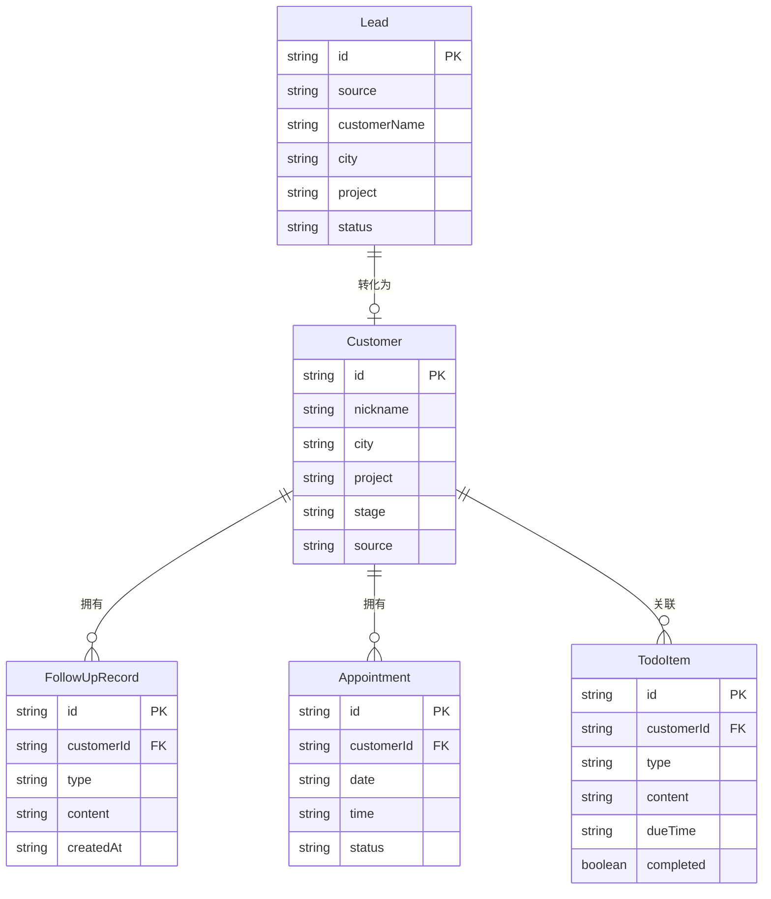

## 1. 架构设计

```mermaid
graph TB
    "移动端React App" --> "Zustand状态管理"
    "Zustand状态管理" --> "Mock数据层"
    "移动端React App" --> "React Router路由"
    "移动端React App" --> "TailwindCSS样式"
```

纯前端项目，使用Mock数据模拟后端接口，后续可对接真实API。

## 2. 技术说明

- 前端：React@18 + TypeScript + TailwindCSS@3 + Vite
- 初始化工具：vite-init (react-ts模板)
- 状态管理：Zustand
- 路由：React Router DOM v6
- 图标：lucide-react
- 图表：recharts
- 后端：无（纯前端Mock数据）
- 数据库：无（使用Mock数据）

## 3. 路由定义

| 路由 | 用途 |
|------|------|
| / | 今日待办页，默认首页 |
| /leads | 新线索提醒页 |
| /customer/:id | 顾客卡片详情页 |
| /appointments | 预约确认页 |
| /profile | 个人业绩页 |

## 4. API定义

无真实后端API，使用Zustand Store + Mock数据模拟。

### 数据类型定义

```typescript
interface Lead {
  id: string
  source: 'xinYang' | 'meiTuan'
  customerName: string
  city: string
  project: string
  packageViewed: string
  message: string
  createdAt: string
  status: 'pending' | 'accepted' | 'transferred'
  assignedTo?: string
}

interface Customer {
  id: string
  nickname: string
  city: string
  project: string
  packagesViewed: string[]
  source: 'xinYang' | 'meiTuan'
  stage: '初问价' | '看案例' | '约面诊' | '已到院'
  phone: string
  createdAt: string
}

interface FollowUpRecord {
  id: string
  customerId: string
  type: 'phone' | 'message' | 'note'
  content: string
  createdAt: string
}

interface Appointment {
  id: string
  customerId: string
  customerName: string
  project: string
  date: string
  time: string
  status: 'pending' | 'confirmed' | 'arrived' | 'completed' | 'lost'
  reminderSent: boolean
  result?: {
    type: 'deal' | 'lost'
    amount?: number
    project?: string
    reason?: string
  }
}

interface TodoItem {
  id: string
  type: 'followUp' | 'appointment' | 'reminder'
  customerId: string
  customerName: string
  content: string
  dueTime: string
  priority: 'high' | 'medium' | 'low'
  completed: boolean
}

interface Performance {
  weekReceptions: number
  weekAppointments: number
  weekDeals: number
  weekRevenue: number
  dailyTrend: { date: string; receptions: number; appointments: number; deals: number }[]
  projectDistribution: { name: string; value: number }[]
  sourceDistribution: { name: string; value: number }[]
}
```

## 5. 服务器架构图

不适用（纯前端项目）

## 6. 数据模型

### 6.1 数据模型定义



### 6.2 数据定义语言

使用TypeScript Mock数据，无需DDL。
